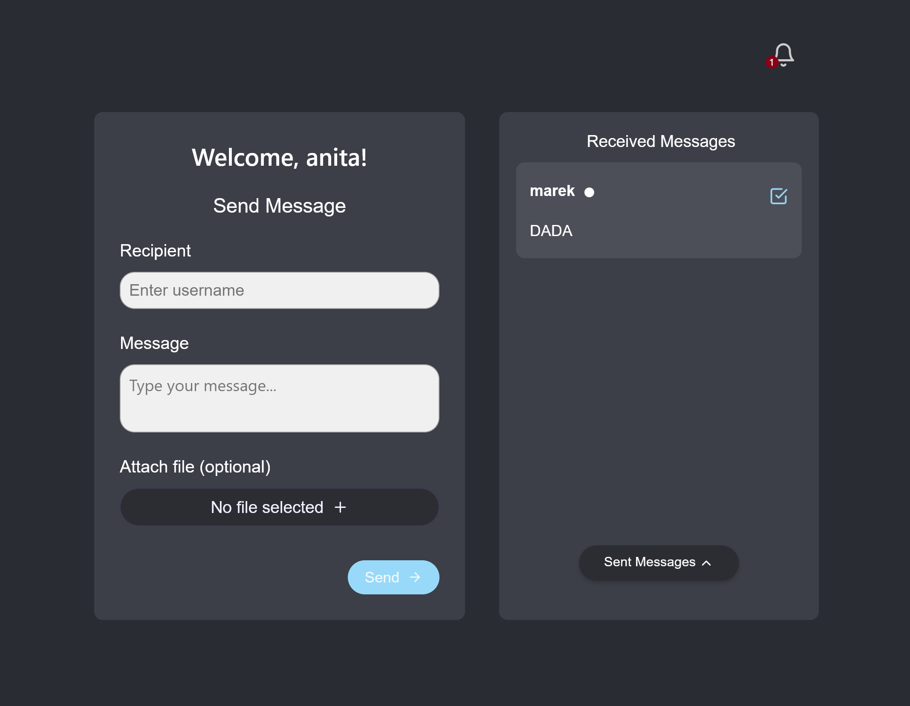
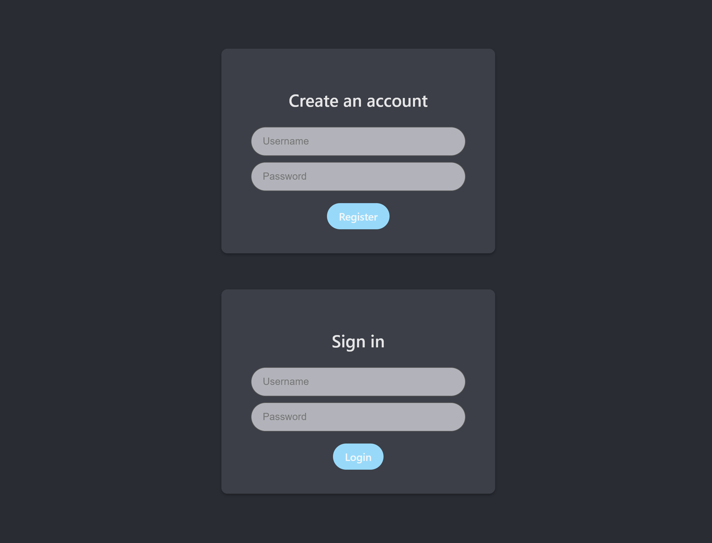

# Cloud-Native Chat Application on AWS

This is a university project designed to create a scalable, cloud-native
messenger-like application. The entire infrastructure is defined as code
(Infrastructure as Code) using Terraform, and the deployment to Amazon Web
Services (AWS) is fully automated.




## 🚀 Key Features

*   ✅ **Simple & Secure Authentication:** User registration and login are
    handled by AWS Cognito. All you need is a username and password to create
    an account and get started.
*   💬 **Messaging:** Once logged in, users can send text messages to other
    registered users.
*   📎 **File Attachments:** Attach files to your messages. Files are stored
    securely in AWS S3, with metadata managed in AWS DynamoDB.
*   🔔 **Real-Time Notifications:** A dedicated notification module alerts
    you to new, unread messages via a bell icon with a counter. Clicking a
    notification takes you directly to the relevant message.
*   📤 **Sliding Panel for Sent Messages:** An animated, slide-up panel allows
    you to view your sent message history at any time without leaving the main
    chat view.
*   🏗️ **Infrastructure as Code (IaC):** The entire cloud architecture—from
    networking and databases to compute services—is defined in the
    `terraform/main.tf` file.
*   🤖 **Fully Automated Deployment:** A single `deploy.sh` script handles
    the entire deployment process: it builds all services and Docker images
    locally, provisions the infrastructure on AWS with Terraform, pushes
    artifacts (images to ECR, Lambda packages to S3), and updates the running
    services.

## ⚙️ Architecture & Technologies

The application is designed with a microservices and serverless architecture
to fully leverage the capabilities of the AWS cloud.

### Frontend

*   Built with React, TypeScript, and Vite.
*   Deployed as a Docker container on AWS ECS Fargate, served via an
    Application Load Balancer (ALB).

### Backend (Spring Boot Microservices)

*   `auth-service`: Integrates with AWS Cognito to handle the login and
    registration processes.
*   `file-service`: Manages file uploads to AWS S3 and stores their metadata
    in AWS DynamoDB.
*   `notification-service`: Handles notifications. It listens to an AWS SQS
    queue, sends push notifications via AWS SNS, and saves notification
    history to DynamoDB.
*   All microservices are deployed as Docker containers on AWS ECS Fargate.

### Chat Logic (Serverless)

*   Core chat operations (sending, receiving, marking as read) are
    implemented as AWS Lambda functions written in Java 17.
*   These functions are exposed to the world through AWS API Gateway, which
    manages request routing and authorization.

### Database

*   Chat messages are stored in a relational PostgreSQL database on AWS RDS.

### Infrastructure & DevOps

*   **Terraform:** The single source of truth for all infrastructure.
*   **Docker:** Containerization for all services.
*   **AWS ECR:** Private Docker image repository.
*   **Bash Script:** Automation of the entire CI/CD process.

## 🚀 How to Deploy to AWS

The deployment process is fully automated. All it takes is a single command!

### Prerequisites

*   AWS CLI installed and configured with access to your AWS account.
*   Docker installed and running.
*   Terraform installed.
*   A terminal that supports bash scripts (e.g., Git Bash on Windows, or any
    terminal on Linux/macOS).
*   **Customize AWS Account ID and Region:** Before running the deployment
    script, you must update the AWS account ID and region to match your own
    environment. See the "Configuration" section below for details.

## 🛠️ Configuration

You need to update your AWS account ID and desired AWS region in two main
files:

### `deploy.sh`

Modify the `AWS_ACCOUNT_ID` and `AWS_REGION` variables at the top of the
script:

```bash
AWS_ACCOUNT_ID="YOUR_AWS_ACCOUNT_ID" # e.g., "123456789012"
AWS_REGION="your-aws-region"     # e.g., "us-east-1"
```

### `terraform/main.tf`

1.  Update the `region` in the `provider "aws"` block:

    ```terraform
    provider "aws" {
      region = "your-aws-region" # e.g., "us-east-1"
    }
    ```

2.  Additionally, update the default value for the `lab_role_arn` variable
    to reflect your AWS account ID. The default value in this variable uses
    a placeholder account ID (`044902896603`), which you'll need to change to
    your actual AWS account ID for the IAM role ARN to be valid in your
    environment:

    ```terraform
    variable "lab_role_arn" {
      description = "ARN of the existing LabRole"
      type        = string
      default     = "arn:aws:iam::YOUR_AWS_ACCOUNT_ID:role/LabRole" # CHANGE THIS PART
    }
    ```

### Execution

1.  Make sure you are in the project's root directory.
2.  Run the `deploy.sh` script using the command below:

    ```bash
    bash deploy.sh
    ```

### What the script does:

1.  **Step 1:** Builds all applications locally (React, Spring Boot, JAR
    packages for Lambda).
2.  **Step 2:** Runs `terraform apply` to create or update the entire
    infrastructure on AWS.
3.  **Step 3:** Pushes the built Docker images to ECR repositories and the
    Lambda function JAR packages to a dedicated S3 bucket.
4.  **Step 4:** Updates the Lambda function definitions to use the new code
    from S3 and forces a new deployment for all services on ECS Fargate to
    pull the latest Docker images.
5.  **Step 5:** Displays the final outputs from Terraform, including the
    public URL for the deployed application.

After the script finishes, the application will be available at the URL
provided in the `frontend_url` output.
